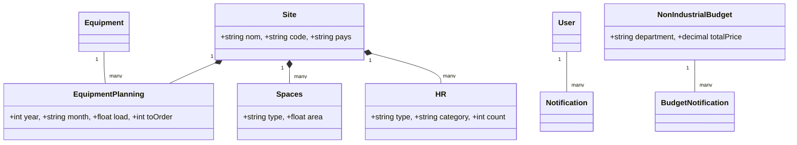

# 📊 Project Reference: NVCapacity (Cofat Capacity Study)

This document contains all the technical and functional specifications required to generate Use Case, Class, and Workflow diagrams for the project.

---

## 1. 👥 System Actors & Roles

| Role | Description | Key Permissions |
| :--- | :--- | :--- |
| **Admin** | Global Administrator | User management, site creation, full access to all site data, and consolidated views. |
| **User** | Site Manager | Data entry for a specific site (HR, Space, Equipment), viewing local reports. |
| **Achat** | Purchasing Agent | Focus on equipment planning, standard investments, and ordering needs across sites. |

---

## 2. 🏗️ Data Architecture (Class Model)

### **Core Entities**
*   **User:** Manages authentication and authorization (Role-based).
*   **Site:** The geographical entity (e.g., Tunisia, Brazil, Mexico). All planning data belongs to a Site.
*   **Equipment:** Catalog of machines available in the company.
*   **EquipmentPlanning:** Time-series data (2025-2027) tracking `machineNeed`, `availableMachine`, `load`, and `toOrder` for a specific Equipment at a specific Site.
*   **Spaces:** Area planning (sqm) categorized by production zones (Cutting, Lead Prep, Assembly) and projects (SCANIA, VW, etc.).
*   **HR:** Human Resources headcount planning divided into `Direct`, `Indirect`, and `Assembly Direct`.
*   **NonIndustrialBudget:** Budgeting for departments like IT, Maintenance, and Quality.
*   **StandardInvestment:** A reference library of equipment costs and specifications.

### **Relationships**
*   `Site` has many `EquipmentPlanning`, `Spaces`, `HR`, and `Budgets`.
*   `Equipment` has many `EquipmentPlanning` entries.
*   `User` has many `Notifications`.
*   `NonIndustrialBudget` has many `BudgetNotifications`.

---

## 3. 🔄 Functional Workflows

### **A. The Planning Cycle**
1.  **Data Input:** Site Managers enter data for their specific location.
2.  **Temporal Logic:** 
    *   **2025:** Data is entered per month (MO 01 - MO 12).
    *   **2026/2027:** Data is entered per quarter (Q 01 - Q 04).
3.  **Calculation:** The system calculates the **Load (%)** based on `machineNeed / availableMachine`.

### **B. The Consolidation Workflow (CofatGroup)**
1.  **Aggregation:** The backend fetches data from **all sites**.
2.  **Summation:** Values for the same period and category are summed (e.g., Total HR for January 2025 across all sites).
3.  **Visualization:** Admin/Achat views a global table that looks identical to the site-specific table but represents the entire group.

### **C. Budget & Purchase Workflow**
1.  **Inventory:** Achat maintains the `StandardInvestments` library.
2.  **Gap Analysis:** The system identifies `toOrder` quantities when `machineNeed > availableMachine`.
3.  **Budgeting:** Departments log `NonIndustrialBudget` needs, which calculate total costs automatically.

---

## 4. 🛠️ Technical Stack
*   **Frontend:** React.js (Component-based UI).
*   **Backend:** Node.js + Express (REST API).
*   **Database:** SQLite / MySQL (via Sequelize ORM).
*   **Auth:** JWT-based / Middleware-protected routes.

---

## 5. 🧜 Mermaid Diagram Code

### **Use Case Diagram**
```mermaid
useCaseDiagram
    actor Admin
    actor "Site Manager" as SM
    actor Achat

    Admin --> (User & Site Management)
    Admin --> (Global Consolidation View)
    
    SM --> (Space & HR Planning)
    SM --> (Equipment Data Entry)
    SM --> (Local Budgeting)
    
    Achat --> (Standard Investment Management)
    Achat --> (View Purchase Needs)
    Achat --> (Global Consolidation View)
```

### **Class Diagram**

